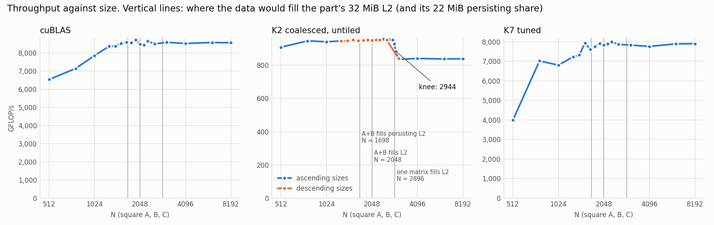
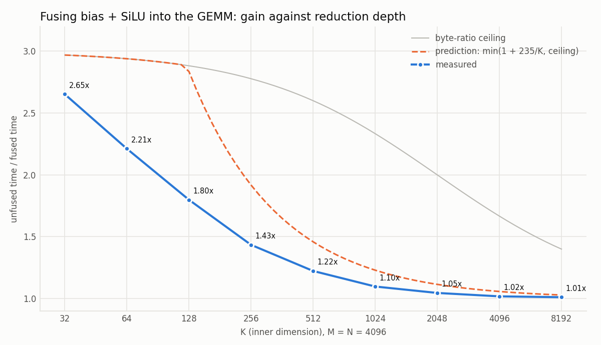
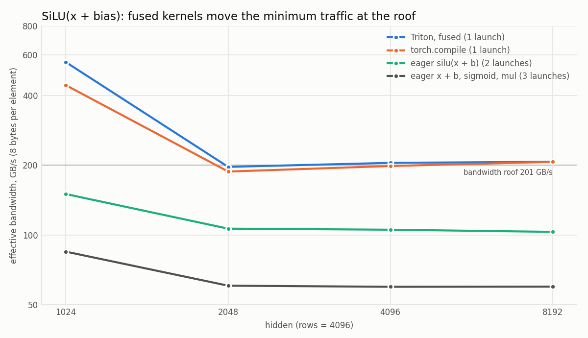
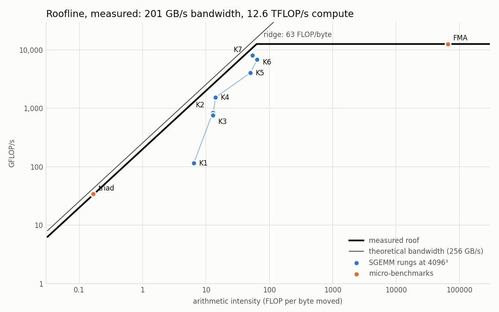

# fused-llm-kernels

An FP32 SGEMM optimization ladder for Ada (sm_89), from a naive kernel to warp
tiling and double buffering, a fused GEMM + bias + SiLU epilogue, and fused
Triton operators. Every step up the ladder is backed by
Nsight Compute data rather than by an explanation of what should have happened.

The technical route itself is well-trodden. What this repository tries to get
right is the engineering around it:

- **Correctness on arbitrary shapes.** Every kernel accepts any `M/N/K`,
  including sizes that are not a multiple of the tile shape. Three shapes are
  checked by `make test` (benchmarks check their selected shapes): `4096³`, `4097×513×129`, and `64³`.
- **Measurement that survives an unsteady GPU clock.** Time-based warmup until
  the SM clock settles, per-iteration CUDA-event timing, median with p10/p90,
  and clock, power and clock-event state recorded with every result row.
- **A roofline built from micro-benchmarks**, not from datasheet numbers.

> **Status: in progress.** The K1-K8 GEMM ladder is implemented, measured and
> profiled; K7 reaches 88.0% of cuBLAS, and K8 (double buffering) is a
> documented negative result at 0.994x of K7. The fused bias + SiLU epilogue
> is measured over K = 32..8192. The first Triton operator, fused bias + SiLU,
> is measured against eager PyTorch and `torch.compile`; RMSNorm and online
> softmax are next.
> Predictions and profiling evidence are documented in `docs/optimization-log.md`.

## Quick start

```bash
bash scripts/env_check.sh      # environment acceptance check
make build
make test                      # correctness: main / non-divisible / tiny shapes
make bench                     # headline 4096³ number -> results/<device>/gemm_4096.csv
make bench KERNELS=k0          # a single rung
make sweep                     # 512..8192 -> results/<device>/gemm_sweep.csv
make profile K=k1              # ncu report -> profiling/reports/<device>/
make epilogue                  # fused-epilogue sweep over K -> results/<device>/epilogue_sweep.csv

make venv                      # Python env for the Triton work (uv; torch 2.14 cu132, triton 3.8)
make check-torch               # torch sees the GPU; cuBLAS, Triton and torch.compile give correct results
make triton-test               # fused bias+SiLU (Triton) and its baselines against a float64 reference;
                               # TRITON_OP=rmsnorm for RMSNorm (also for the two targets below)
make triton-bench              # eager / torch.compile / Triton timings -> results/<device>/triton_bias_silu.csv
make triton-profile IMPL=eager # ncu report for one implementation (TSHAPE=4096x1024 for another shape)
```

`DEVICE` (default `rtx4060-laptop`) names the directory results are written to;
`ARCH` (default `sm_89`) selects the build target.

`scripts/install_cuda_wsl.sh` installs the CUDA toolkit inside WSL2 if needed.
The Python environment is pinned in `requirements-lock.txt`. The torch wheel
is built for sm_86 and newer major architectures but not for sm_89
specifically; it runs on this part through same-major compatibility, which
`make check-torch` verifies.

## The ladder

Measured at `4096³` on an RTX 4060 Laptop GPU. K1-K5 share one run;
K6-K7 and K8 summarize three later runs each. Each percentage uses the cuBLAS measurement
from its own run (`results/rtx4060-laptop/gemm_4096.csv`).

| Rung | What it adds | Bottleneck left for the next rung | GFLOP/s | % of cuBLAS | vs previous |
|---|---|---|---|---|---|
| K0 | cuBLAS baseline, timed through the same harness | - | 9115.1 | 100% | - |
| K1 | naive: one thread per element of C | uncoalesced global access | 115.8 | 1.3% | - |
| K2 | coalesced access (swap the thread-to-data mapping) | balanced compute and memory paths | 845.5 | 9.3% | 7.30x |
| K3 | shared-memory tiling (BM×BK / BK×BN) | staging overhead and limited resident blocks | 757.6 | 8.3% | **0.90x** |
| K4 | 1D thread tiling (TM results per thread) | register reuse | 1541.4 | 16.9% | 2.03x |
| K5 | 2D thread tiling (TM×TN register block) | saturated memory request path | 4062.9 | 44.6% | 2.64x |
| K6 | float4 vectorized loads, transposed A tile | latency and parallelism | 6899.5 | 75.9% | 1.70x |
| K7 | warp tiling + parameter search (128×64×16, 8×4) | occupancy bounded by registers and shared memory | 8041.9 | 88.0% | 1.16x |
| K8 | double buffering (two alternating shared tiles, one barrier per tile) | memory throughput; the hidden load latency is paid back in L1 misses | 7845.6 | 86.7% | **0.994x** |

The baseline itself was measured four times (rows 2, 8, 9, 10): 9115.1,
9045.0, 9010.9, 8918.5 GFLOP/s - a median of 9028.0 with a 2.18% run-to-run
range, falling monotonically as the part heats from 75 to 82 C and its settled
clock drops from 2415 to 2346 MHz. Percentages above carry that uncertainty.
An earlier baseline taken with the host power configuration set wrong came out
26.2% lower, which is why the enforced power limit is recorded in every row.

K6 and K7 are medians of three runs after a cooldown, each run measuring K0,
K6 and K7 together (0.43% and 0.57% ranges); K6's ratio to K5 spans two runs
whose cuBLAS results both sit inside the band. K7's 1.16x over K6 comes from the parameter
search, not from warp tiling itself - with K6's geometry, warp tiling alone
runs at about 0.96x (`results/rtx4060-laptop/tuning_k7.csv`).

K3 is slower than K2, and the profile says why: K2 was already served out of
L1 at a 94.98% hit rate, so moving the same data into shared memory by hand
replaced a free cache with an explicit copy and two barriers per tile. The
optimization log carries the full reading.

K8 is the second negative result, and a close one. It is measured in its own
three runs with the order `K0, K7, K8, K8, K7`: the later slots run hotter and
at a lower clock, so each kernel is the mean of an early and a late slot, and
"vs previous" is the same-run K8/K7 ratio (0.993-0.995). Loading the next tile
into a second shared buffer while the current one is computed does hide load
latency - with occupancy unchanged at 65.83%, the share of time with no
eligible warp falls from 29.94% to 26.78% - but interleaving reads of one
buffer with stores to the other halves the L1 hit rate (34.71% to 16.33%), and
total elapsed cycles end up equal to K7's within 0.05%. An earlier form that
held the prefetched values in registers needed 71 registers per thread instead
of 64, which lowers the resident blocks per SM from four to three, and used
2.7% more elapsed cycles than K7 in paired profiles; it is kept as
`k8c1`-`k8c5`. `make test-k8` checks
nonzero initial C, alpha/beta, empty reductions and tile boundaries for every
K8 entry.

### Size sweep



K2, which reads A and B straight from global memory, loses 12% between 2880
and 3072 and never recovers, and the profile shows why: its L2 hit rate halves
(90% to 46%) and DRAM's share of its traffic quintuples. The step sits where a
single 32 MiB matrix no longer fits in L2 (N = 2896), not where A and B
together stop fitting (N = 2048) - the location that had been predicted
before the sweep. cuBLAS and K7 move data in tiles and show no step. Details,
including the predictions and the extra sizes that located the step, are in
the optimization log.

### Fused epilogue: GEMM + bias + SiLU



A feed-forward projection is `SiLU(A·B + bias)`. Unfused, the product is
stored in an M×N buffer and a second kernel loads it, adds the bias, applies
SiLU and stores the result: one more launch, one more M×N store and one more
M×N load. `e1` does the bias and SiLU in the register block of the
K7-structured GEMM before the single store; `e0` is the same template writing
the plain product, followed by the element-wise pass. (K7 itself is not used
as the unfused baseline: its `beta` term loads C even when `beta` is 0.)

The saving is a fixed cost that does not depend on K, so the gain is
`1 + T_pass / T_fused(K)`: **2.65x at K = 32, 1.43x at K = 256, 1.10x at
K = 1024 and 1.02x at K = 4096** (`results/rtx4060-laptop/epilogue_sweep.csv`,
M = N = 4096, each kernel timed in an early and a late slot of every shape).
The element-wise pass is a pure memory mover: its profile shows 204-232 GB/s,
at or above the measured bandwidth roof, and 17% compute throughput, for
0.50-0.64 ms per call. The prediction committed beforehand used the right
byte count but a lower bandwidth (100-200 GB/s), and modelled the curve as
`min(1 + c/K, byte-ratio ceiling)` with a corner; the measured gain is about
0.43x of the predicted `c`, and the curve is smooth because the fused kernel
itself has a fixed cost at small K. The optimization log has the full
comparison. Both kernels compile to 71 registers per thread at K7's geometry
(K7: 64), so both keep three blocks per SM; the comparison is like for like.

### Triton: fused bias + SiLU



`SiLU(x + bias)` does almost no arithmetic per element, so its cost is the
bytes it moves. Fused - one Triton program per row, or `torch.compile` - it
loads x and stores the result, 8 bytes per element, and both run at the
measured bandwidth roof for hidden 2048-8192 (197-207 GB/s effective against
200.6). Eager `silu(x + b)` makes an intermediate and runs two kernels:
1.85-2.01x the fused time. Written as `t = x + b; t * sigmoid(t)` it runs
three kernels and moves 28 bytes per element: 3.26-3.46x
(`results/rtx4060-laptop/triton_bias_silu.csv`, rows = 4096). Each profiled
kernel of every implementation moves 217-240 GB/s at 4096 x 4096, so the
ratios are the ratios of bytes.

At hidden 1024 the ratios grow to 3.7x and 6.6x, and the prediction missed
there: every kernel runs about twice as fast per element at that size, while
the eager paths carry host-side time beyond their kernels that does not
shrink with them. `torch.compile` is within 5% of the handwritten kernel from
hidden 2048 up and 26% slower at 1024, where its wrapper is a visible part of
a 76 us call. The optimization log has the profiles.

### Roofline



Both roofs are measured on this part: 200.6 GB/s of achievable bandwidth
(78% of what the memory clock and bus width allow) and 12.6 TFLOP/s of
sustained FP32 compute, meeting at 63 FLOP per byte. A triad sits exactly on
the slanted roof and a register-only FMA loop defines the flat one. The rungs
climb towards the ridge; K7 reaches 74% of the roof at its intensity and
cuBLAS 72% of the compute roof. `profiling/plot.py` draws both figures from
the CSVs and the exported profiles.

Boundary handling is done with guard branches rather than padding, so a kernel
is tested on `4097×513×129` as well as divisible shapes. Passing these tests
is evidence for boundary handling, not a proof for every possible input.

## Measurement

- CUDA events, timed per iteration; **median with p10/p90**, never a mean.
  Dividing a total by a count hides clock drift; the distribution does not.
- **Warmup is measured in time, not iterations.** The GPU is kept loaded for at
  least 30 s and then until its SM clock stops trending: the mean over the last
  five one-second samples must be within 1% of the mean over the five before
  (capped at 4× the minimum). Whether it settled is recorded, together with the
  clock's mean and peak-to-peak range over that final window. A fixed count is
  meaningless across shapes: 25 iterations of a 3 ms kernel end while the GPU is
  still on a boost clock it cannot sustain, so the first timed repetitions come
  out faster than the rest. Means are compared rather than individual samples
  because a power-capped GPU keeps dithering by several percent around its
  steady operating point; that dither is the floor under the per-iteration
  spread.
- ≥ 100 repetitions. When (max − min) / median exceeds 5%, the run is flagged
  and the median is not quoted without an explanation from the clock data.
- Every row records SM clock, memory clock, temperature, power draw and active
  clock-event reasons before warmup, at the start of timing and after it, plus
  how long SW power capping and thermal or power-brake slowdown were active
  during the timed region (the driver advances these counters in coarse steps,
  so they are only meaningful over timed regions of several seconds). It also records the device tag, the source revision
  and a UTC timestamp. The runner refuses to write CSV rows without these, and
  rows from kernels that fail the correctness check are never written.
- The enforced GPU power limit is recorded too, and a benchmark refuses to start
  (or to write its row) when the limit is below a per-device minimum. A laptop
  GPU loses most of its power budget when the host leaves its high-performance
  power plan, silently turning every later number into a measurement of a
  different machine.
  Clocks cannot be locked from user space, so a speedup reported without the
  clock it was measured at is not a speedup.
- Correctness is checked against cuBLAS under two tolerances that must both
  hold: element-wise relative error < 1e-3 **and** relative Frobenius error
  < 1e-5. Neither catches what the other misses. The element-wise check uses a
  floor of 5% of the reference RMS, so rounding differences on near-zero
  elements are not mistaken for bugs.
- Benchmark rows are refused when the code that produced them is not
  committed, carry the kernel's configuration, and are flagged when the cuBLAS
  run inside the same benchmark falls outside its run-to-run band.
- Benchmarks are only valid with the full-power adapter connected, with the host power plan set to high
  performance and no other GPU load running. The reported GPU power limit and
  an in-band cuBLAS check are necessary diagnostics; neither proves that the
  physical adapter can supply the required power.

`GFLOP/s = 2·M·N·K / t`.

## Hardware this was developed on

| | |
|---|---|
| GPU | RTX 4060 Laptop GPU (AD107, sm_89), 24 SMs, 8 GB |
| L2 | 32 MB |
| Shared memory per block | 48 KB by default (Ada allows opting in to ~99 KB) |
| Toolchain | CUDA 13.3, driver 610.47 |
| Host | WSL2 (Ubuntu) |

Peak FP32 throughput and peak achievable bandwidth are deliberately **not**
taken from the datasheet: this is the mobile part, whose clocks and power
budget move with temperature. Both roofline ceilings have been measured with
the micro-benchmarks in `csrc/roofline/`; see `results/rtx4060-laptop/roofline.csv`.

Profiling under WSL2 requires GPU performance counters to be opened up on the
Windows host: NVIDIA Control Panel → Developer → Manage GPU Performance
Counters → allow access to all users.

## Layout

```
csrc/kernels/     one file per rung (plus e_epilogue.cu); add one = declare in kernels.h + a row in registry.cu
csrc/harness/     runner.cu: correctness, timing, CSV
csrc/common/      error-checking macros, input generation, the two-tolerance check
docs/             design notes and the optimization log
results/          benchmark CSVs, one directory per device; every published number comes from here
profiling/        Nsight Compute reports and the roofline scripts
triton_kernels/   fused Triton operators
```

## References

- siboehm, [How to Optimize a CUDA Matmul Kernel](https://siboehm.com/articles/22/CUDA-MMM)
- The Triton [layer-norm tutorial](https://triton-lang.org/main/getting-started/tutorials/05-layer-norm.html)

## License

MIT
