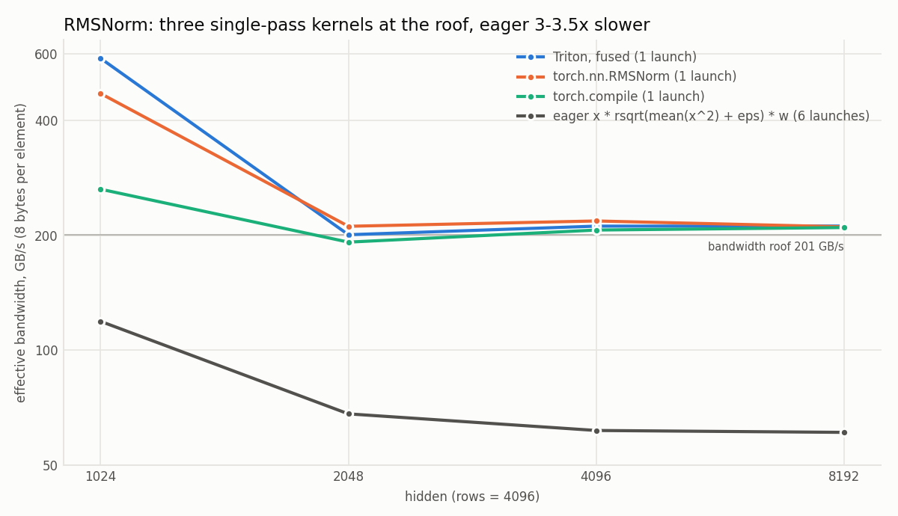
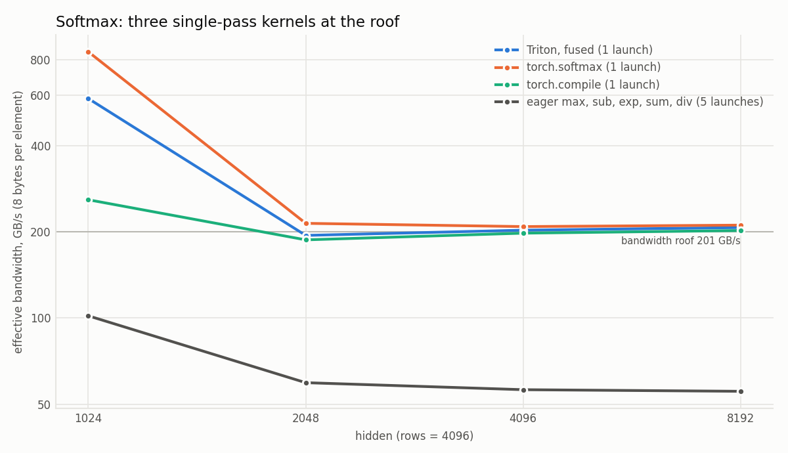
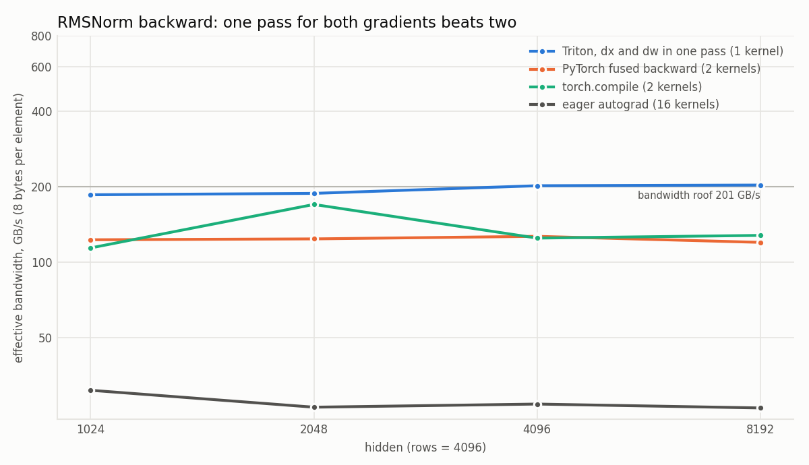

# Optimization log

One entry per rung, written when the rung is finished. Each entry states what
was predicted before running anything, what was actually measured, and where
the two disagree. The prediction is written first, on purpose: a number without
a prediction to compare it against teaches nothing about the hardware.

Every number here traces to a row in `results/` or to a report in
`profiling/reports/`. Entries marked pending have not been measured yet.

Entry template:

- **Hypothesis** - which bottleneck this rung targets, and which ncu metric
  should move as a result.
- **Prediction** - GFLOP/s and the reasoning behind it, recorded before the
  first benchmark run.
- **Measured** - median GFLOP/s at `4096³`, with the source CSV row.
- **Difference** - if prediction and measurement disagree, whether the wrong
  part was the assumption or the implementation.
- **Evidence** - the ncu metric that settles it.

---

## Environment baseline

Measured by `scripts/env_check.sh` on 2026-08-25.

| | |
|---|---|
| GPU | RTX 4060 Laptop GPU (AD107, sm_89) |
| SMs | 24 |
| L2 | 32 MB |
| Shared memory per block | 48 KB default (Ada allows opting in to ~99 KB) |
| Memory | 8 GB |
| Driver / CUDA | 610.47 / 13.3 |
| Nsight Compute counters | available (requires opening GPU performance counters to all users on the Windows host) |

This is the **mobile** part, not the desktop 4060: the power budget floats and
the clocks are unstable, so datasheet throughput and bandwidth figures are not
usable as roofline ceilings. Both ceilings were subsequently measured with
micro-benchmarks; see the Roofline section and `results/rtx4060-laptop/roofline.csv`.

## K0 - cuBLAS baseline

Not a rung to optimize, but the reference. Timed through the same harness, on
the same inputs, in the same device buffers, with no transposes or copies: the
baseline has to see exactly the memory layout the kernels see, or the
comparison is not fair. Also serves as the correctness reference for every
other kernel.

- **Measured**: the baseline was re-established across four independent runs
  once the host power configuration was corrected (rows 2, 8, 9, 10): 9115.1,
  9045.0, 9010.9 and 8918.5 GFLOP/s, a **median of 9028.0 with a 2.18%
  run-to-run range**. The four runs fall monotonically as the part heats
  (75 to 82 C, settled SM clock 2415 down to 2346 MHz), so back-to-back runs
  drift downward and a baseline has to be quoted as a median with its
  run-to-run range rather than as a single number. Note that within one run
  the per-iteration spread (5.6% to 16.4%) is larger than the spread between
  runs.
- Each rung below is quoted against the cuBLAS run inside its own benchmark
  (9115.1 GFLOP/s, row 2), which is what the `pct_cublas` column records;
  those percentages carry the 2.2% baseline uncertainty.
- **Measured earlier, under a misconfigured host power setting**: 7151.8
  GFLOP/s (row 1, spread 11.7%), 26.2% below the corrected baseline. That run sat under SW power capping for its whole timed
  region (939 ms of capping over 2.0 s) with the SM clock dithering 8.6%
  across the final warmup window; the later run had no capping at all and
  0.0% dither. The rows are not comparable, which is why the power limit is
  now recorded in every row - the older row predates the column and leaves it
  empty. Power budget alone moved the baseline by 27%.

## K1 - naive

One thread per element of C, no shared memory, no blocking. This is the floor
of the ladder and the reference ncu report that every later rung is read
against.

- **Hypothesis**: uncoalesced global access. threadIdx.x selects the row, so
  threads scheduled together in a warp read rows of A and write rows of C
  that are K and N elements apart. Each inner iteration reads 8 bytes for 2
  FLOPs, about 0.25 FLOP/byte, so the kernel should be heavily memory-bound:
  SpeedOfLight should name memory as the bottleneck and MemoryWorkloadAnalysis
  should show DRAM traffic dominating.
- **Prediction**: 45 GFLOP/s (range 25-70), recorded before the first
  benchmark run. At 0.25 FLOP/byte the roof is 0.25 x 256 GB/s = 64 GFLOP/s,
  where 256 GB/s is the theoretical bandwidth derived from the
  driver-reported memory clock and bus width; uncoalesced access should not
  reach it. A result above 64 would mean many accesses never reach DRAM (the
  L2 hit rate should show it); below 20 would point at occupancy or launch
  overhead rather than bandwidth.
- **Measured**: 115.8 GFLOP/s, 1.27% of the cuBLAS baseline (1186.6 ms
  median, spread 2.7%; row 3).
- **Difference**: 2.6x above the predicted 45 and outside the predicted range.
  The prediction assumed every inner iteration reaches DRAM, which would cap
  the kernel at 64 GFLOP/s; measuring above that cap falsified the assumption
  exactly the way the prediction said it would.
- **Evidence** (`profiling/reports/rtx4060-laptop/k1_20260915_221324.details.csv`):
  DRAM throughput is 5.29% of peak while the L1/TEX cache path sits at 99.07%
  and its hit rate at 99.08%. The kernel is not bandwidth-bound at all; it is
  bound by the number of memory requests. The uncoalesced mapping turns one
  warp instruction into 32 separate sector requests, and each warp spends
  210.3 cycles stalled on the queue for global memory instructions, with
  226.2 warp cycles per issued instruction and no eligible warp 96.5% of the
  time. Bytes were the wrong unit for this rung; requests were the right one.

## K2 - coalesced access

The same computation and launch shape as K1 with one change: threadIdx.x
selects the column instead of the row, and the grid dimensions swap with it.

- **Hypothesis**: for every k, the threads of a warp now read the same element
  of A, adjacent elements of one row of B, and write adjacent elements of one
  row of C, so their accesses can be coalesced. The amount of computation is
  unchanged; any speedup over K1 has to come from memory traffic.
- **Prediction**: 150 GFLOP/s (range 90-450), recorded before the first
  benchmark run. Two models disagree on the size of the gain. Counting bytes,
  a warp reads 132 bytes per 64 FLOPs instead of 256, about 2x less traffic,
  which would cap K2 near 124 GFLOP/s. Counting accesses, 32 scattered reads
  of A per warp per k become one, which would allow a gain well above 5x. The
  measured K2/K1 ratio decides between them: at or below 2.5x the kernel is
  still bandwidth-bound; at or above 5x access coalescing dominates, and
  MemoryWorkloadAnalysis should show uncoalesced and DRAM accesses collapsing.
- **Measured**: 845.5 GFLOP/s, 9.28% of the baseline, **7.30x over K1**
  (162.5 ms median, spread 1.4%; row 4).
- **Difference**: above the predicted 150. Of the two competing models in the
  prediction, the byte model (which expected at most 2.5x) is falsified and
  the access-count model is confirmed.
- **Evidence** (`k2_20260915_221400.details.csv`): stall cycles on the global
  memory queue fall from 210.3 to 18.4 per warp and warp cycles per issued
  instruction from 226.2 to 30.2, while DRAM throughput only rises from 5.3%
  to 20.1% - the traffic in bytes barely changed, the number of requests
  collapsed. Compute and memory now sit at the same 90.6% of peak, which the
  profiler reports as a balanced workload.

## K3 - shared-memory tiling

Keeps the coalesced mapping of K2 and adds one level of blocking: for every
tile of 32 values of k, the block copies the matching 32x32 pieces of A and
B into shared memory, and the inner products read only those copies. Each
thread loads one cell of each shared array, which covers both only because
the tile is square. Threads outside the matrix still load and synchronize;
two synchronizations per tile keep loading and reading apart.

- **Hypothesis**: after K2, every inner iteration still reads global memory,
  and A and B are each larger than L2, so the kernel should be bound by DRAM
  bandwidth. Reading global memory in batches moves that bound: a tile reads
  8 KiB from DRAM and then performs 65,536 FLOPs on the shared copy, so DRAM
  traffic per FLOP drops by more than an order of magnitude. The new limits
  should be shared-memory bandwidth and the cost of 256 thread
  synchronizations per block at `4096³`. MemoryWorkloadAnalysis should show
  the DRAM share falling; SchedulerStats and WarpStateStats should show time
  spent waiting at synchronization.
- **Prediction**: 250 GFLOP/s (range 120-600), recorded before the first
  benchmark run. The range is wide because shared-memory bandwidth on this
  part has not been measured. If K3 is not faster than K2, synchronization or
  shared-memory conflicts ate the gain; if it is more than 4x faster, K2 was
  firmly bandwidth-bound, which the K2/K1 ratio should confirm independently.
- **Measured**: 757.6 GFLOP/s, 8.31% of the baseline, **0.90x of K2: this
  rung is 10% slower than the one before it** (181.4 ms median; row 5).
- **Difference**: the prediction's falsification clause fired - "if K3 is not
  faster than K2, synchronization or shared-memory conflicts ate the gain".
  The cause turned out to be more specific than that.
- **Evidence** (`k3_20260915_221407.details.csv`): the L1/TEX hit rate drops
  from 94.98% in K2 to **0.39%**. K2 was already being served almost entirely
  out of L1: the hardware cache was doing, for free, what this rung does by
  hand. Copying the same data into shared memory replaces those hits with an
  explicit copy plus two block-wide barriers per tile, and moves the queue
  pressure from the global-memory queue to the MIO queue (27.0 stall cycles
  per warp). DRAM throughput does fall, 20.1% to 17.7%, so the tiling does
  what it was supposed to do - there was simply nothing left to win, because
  L1 had already won it. Occupancy is unchanged at 66.7%, and with 8.19 KB of
  shared memory per 1024-thread block only one block fits per SM.
  The lesson generalizes: a manual cache only pays once the automatic one
  stops working, which is why the next rung keeps the tiles and changes what
  each thread does with them.

## K4 - 1D thread tiling

Same 32x32x32 shared-memory tiles as K3. Each thread owns 8 consecutive rows
in one column of C: a block runs 32x4 threads instead of 32x32, and for
every k the thread reads the shared B value into a register once and reuses
it for all 8 results.

- **Hypothesis**: K3 still runs one thread per result, and for every k the 8
  results stacked in a column each re-read the same shared value of B. Reading
  it once cuts shared-memory traffic per FLOP from 4 to 2.25 bytes, and an
  eighth of the threads doing eight times the work dilutes per-thread
  scheduling and synchronization overhead. What remains is the A side, which
  is still read once per result.
- **Prediction**: 450 GFLOP/s (range 200-1100), recorded before the first
  benchmark run: roughly 1.8x the K3 prediction from the traffic reduction,
  plus the diluted overhead. If K4 is not faster than K3, four warps per block
  are too few to keep the SMs occupied (Occupancy's block limits should show
  it); if it is more than 3x faster, K3 was bound by thread scheduling rather
  than by shared-memory bandwidth.
- **Measured**: 1541.4 GFLOP/s, 16.91% of the baseline, **2.03x over K3**
  (89.2 ms median; row 6).
- **Difference**: inside the predicted range of 200-1100 - the only rung whose
  absolute prediction held - and the measured 2.03x matches the predicted 1.8x
  ratio. This is also the rung whose gain could be computed in advance from
  traffic alone, without knowing which cache would catch what.
- **Evidence** (`k4_20260915_221414.details.csv`): achieved occupancy rises
  from 66.7% to 82.8% (128-thread blocks at 48 registers per thread allow 10
  blocks per SM instead of one), compute and memory both reach 98.0% of peak,
  and effective memory throughput rises from 45.1 to 81.3 GB/s. Stall cycles
  on the MIO queue fall from 27.0 to 23.6 per warp.

## K5 - 2D thread tiling

Each thread owns an 8x8 block of C. For every k it reads the 8 values of A
and the 8 values of B it needs into registers and accumulates their outer
product into 64 result registers. Tiles change to 128x128 results with 16
values of k per tile: a 2D split divides the threads per block by 8 in both
directions, and 32x32 tiles would leave 16 threads per block, fewer than one
warp. This rung therefore changes two things at once, which the profile has
to separate.

- **Hypothesis**: K4 reuses registers only on the B side; the A values are
  still read once per result. With an 8x8 register block, shared-memory
  traffic falls from 2.25 to 0.5 bytes per FLOP and the inner multiply-add
  runs entirely in registers. The limit should start moving to the compute
  side: 80 register floats per thread and 8x fewer, heavier threads than K4,
  so Occupancy's register and warp limits become relevant. Accessing A down a
  column and B along a row in the same loop is left for the next rung.
- **Prediction**: 750 GFLOP/s (range 350-2000), recorded before the first
  benchmark run, about 1.7x the K4 prediction. That is roughly 10% of the
  measured cuBLAS baseline, six times below an estimate of 60-80% made before
  the ladder was started. The gap is traceable to one assumption: every
  prediction from K1 on compounds the claim that K1 is bandwidth-bound near
  0.25 FLOP/byte. If K1 measures at 150 GFLOP/s or more, the starting point
  is wrong and only the rung-to-rung ratios remain testable; if K5 reaches
  60% of cuBLAS, the earlier estimate was right. If K5 is within 10% of K4,
  register or occupancy limits cancelled the 2D split, or the tile change
  cost something, which Occupancy and LaunchStats should separate.
- **Measured**: 4062.9 GFLOP/s, **44.57% of the cuBLAS baseline**, 2.64x over
  K4 (33.8 ms median; row 7).
- **Difference**: above the predicted range of 350-2000, and the ratio 2.64x
  is above the predicted 1.7x. The absolute prediction chain was too low at
  every rung because its first link assumed K1 was DRAM-bound; the profile
  showed it was request-bound instead, and every later prediction inherited
  the error. The rung-to-rung ratios held up better than the absolute values:
  2.03x predicted 1.8x for K4, while K2 and K5 both beat their predicted
  ratios and K3 went the other way entirely.
- **Evidence** (`k5_20260915_221418.details.csv`): the bottleneck has moved.
  Compute sits at 59.6% of peak while memory sits at 96.4%, so the limit is
  now the memory pipe feeding the registers, not the arithmetic. Warp cycles
  per issued instruction fall from 36.3 to 10.4 and MIO stalls from 23.6 to
  3.6 cycles. This happens despite occupancy halving to 33.0%: at 121
  registers per thread only 2 blocks fit per SM, and the work per thread makes
  up for the missing warps. Shared-memory traffic per FLOP is what the next
  rung has to attack.

## K6 - float4 vectorized loads, transposed A tile

Same geometry as K5. Three changes, all about instruction count rather than
bytes: the A tile is stored transposed so the values a thread needs for one k
are contiguous, the inner loop reads both operands as float4 (16 scalar shared
loads per k become 4 vector loads), and the global loads are vectorized as
well. float4 needs 16-byte alignment, so the vector path is taken only when K
and N are multiples of 4 and the group of four stays inside the matrix;
otherwise the loads fall back to element at a time, which is what the
`4097x513x129` shape exercises.

- **Hypothesis**: K5 was limited by the memory pipe feeding the registers
  (96.4% against 59.6% compute). The same bytes, fetched with a quarter of the
  instructions, should relieve it. The transposing store costs four scalar
  stores per chunk, but it runs once per tile while the inner loop runs 16
  times, so the trade should pay.
- **Prediction**: 7534 GFLOP/s (range 5795-8577), recorded before the
  benchmark ran. The lower end, 5795, is a floor derived from K5's own profile:
  at 59.59% compute throughput the arithmetic alone cannot take less than
  33.828 ms x 0.5959 = 20.158 ms, which is 6818 GFLOP/s at perfect efficiency.
  Exceeding 6818 would mean that ceiling was not a ceiling.
- **Measured**: 6899.5 GFLOP/s (19.920 ms), the median of three runs taken
  alongside K7 (0.43% range), **75.85% of the cuBLAS run in the same
  benchmark** and 1.70x over K5 (across runs, each with cuBLAS inside its
  run-to-run band). This entry first quoted a single run of 6902.8 GFLOP/s
  (rows 11-13 of `gemm_4096.csv`); that run was taken from an uncommitted
  tree, so its rows stay in the file but are no longer quoted. The numbers
  agree within 0.05%.
- **Difference**: inside the predicted range but 8% under the point estimate,
  and 1.2% **past** the supposed compute ceiling: 19.920 ms against 20.158 ms.
  The ceiling assumed the arithmetic work was irreducible, but vectorizing also
  removes address arithmetic, which is compute-side work - registers per thread
  fall from 121 to 107. A ceiling derived from a profile is only a ceiling for
  changes that leave the instruction mix alone.
- **Evidence** (`profiling/reports/rtx4060-laptop/k6_20260915_234804.details.csv`):
  the memory pipe drops from 96.35% to 71.37% of peak and the L1/TEX path from
  97.33% to 73.13%, warp cycles per issued instruction from 10.43 to 6.97, and
  the share of cycles with no eligible warp from 62.01% to 41.95%. Achieved
  occupancy is unchanged at 33%. Same bytes, same occupancy, 1.7x the
  throughput: on this part the memory path is limited by requests, not by
  bytes - the same conclusion K1 and K2 reached from the other direction.
- **Where the limit is now**: memory 71.37%, compute 56.54%, neither
  saturated, occupancy 33.16% with 107 registers per thread allowing two
  blocks per SM. The limit has moved from a saturated pipe to latency and
  parallelism.

## K7 - warp tiling and a parameter search

A blocking level between the block tile and the per-thread register block:
each warp owns a WM x WN sub-tile and its 32 threads cover it exactly. The
kernel is a template over (BM, BN, BK, TM, TN, WM, WN) with the constraints
between them as static assertions, and `make tune` measures nine
configurations in one run. `k7` is the configuration the search selected;
`k7c1` keeps K6's tile and thread count exactly, so K6 against `k7c1`
isolates the warp-level blocking from the tuning.

- **Hypothesis**: after K6 neither the compute nor the memory side is
  saturated (56.5% and 71.4%), while occupancy sits at 33% with 107
  registers per thread and two blocks per SM. The limit is latency and
  parallelism, not a saturated pipe. Warp tiling shrinks the shared-memory
  footprint of a warp from 144 locations per k to 96; smaller tiles would
  need fewer registers per thread and fit more blocks on an SM.
- **Prediction**, recorded before any K7 run: warp tiling alone 1.10x over K6;
  the best searched configuration 8300 GFLOP/s (range 7600-8577); and the
  winner would be one of the smaller-tile configurations. With neither pipe
  saturated, the throughput ceilings derived from K6's profile both sit above
  cuBLAS and bound nothing, so these predictions rest on structure alone.
- **Measured**: **8041.9 GFLOP/s**, the median of three runs taken after a
  cooldown (8008.7 to 8054.8, a 0.57% range); **88.04% of the cuBLAS run in
  the same benchmark** (87.95% to 88.37%) and **1.164x over K6** (1.161x to
  1.171x). All three runs have cuBLAS inside its run-to-run band.
- **Search** (`results/rtx4060-laptop/tuning_k7.csv`, one run): k7 8027.9,
  c4 7102.4, c2 6748.9, **c1 6594.5**, c7 6241.2, c5 6148.2, c8 6128.1, c6
  5988.5; c3 is the same configuration as k7 and measured 7998.9, 0.36% apart.
  The ranking repeats one taken earlier on uncommitted code, which is not
  published.
- **Difference**: the structural prediction held - the two smaller-tile
  configurations came first and second, and the searched best landed inside
  its range, 3.1% under the point estimate. The quantitative prediction for
  warp tiling did not: **K6's geometry with warp tiling (c1) runs at about
  0.96x of K6**. The 1.164x gain comes entirely from the tuning. Quoting
  "warp tiling: 1.16x" would be wrong, which is what the control
  configuration is for.
- **Evidence** (`profiling/reports/rtx4060-laptop/k7_20260916_002316.details.csv`):
  achieved occupancy doubles from 33.16% to 65.83%; registers per thread fall
  from 107 to 64, so the register limit allows four blocks per SM instead of
  two; eligible warps per scheduler rise from 1.57 to 3.07 and cycles with no
  eligible warp fall from 41.95% to 29.98%. The cost is visible too: the
  L1/TEX hit rate falls from 61.23% to 34.77% as each thread reuses less, and
  warp cycles per issued instruction rise from 6.97 to 11.31. Twice the warps
  more than pay for slower ones.
- **Where the limit is now**: compute 67.2%, memory 75.2%, still neither
  saturated, with occupancy bounded by registers and shared memory. 88.04%
  leaves 1.075x before the historical prediction target of 95% of cuBLAS.
  That target is an unverified assumption, not a measured ceiling.
- **Measurement note**: an earlier run of this configuration, taken after
  hours of back-to-back benchmarks with the part at 80-85 C, came out 8%
  lower. Three runs after a cooldown agree within 0.57%; that run is not used.

## Size sweep: where L2 stops holding the data

`make sweep` measures cuBLAS, K2 and K7 at 17 square sizes from 512 to 8192,
dense between 1408 and 2304 (`results/rtx4060-laptop/gemm_sweep.csv`). K2 is
the rung that should show an L2 effect most clearly: it is untiled and reads
A and B from global memory at every step. K2 was also swept a second time in
descending order around the candidates, so a step that is really thermal drift
would move between the two passes.

- **Prediction**, recorded before the sweep: a knee in K2 where A + B
  (8 N^2 bytes) fills L2. Two candidate capacities - the full 32 MiB (N = 2048)
  or the 22 MiB the driver reports as the persisting share (N = 1698) - plus a
  live alternative, no knee at all, because K2's profile at 4096^3 shows DRAM
  at only 20% of its traffic. The knee was defined in advance as the first N
  at least 5% under the best of all smaller N, with the next point under that
  bar too. No knee was predicted for cuBLAS or K7.
- **Measured**: K2 is flat from 512 to 2560 (941 to 957 GFLOP/s) and then
  steps down by 12% to about 838, where it stays up to 8192. The descending
  pass, which reached 3072 first and coolest, shows the same step, so it is a
  size effect. cuBLAS and K7 show no knee. All three candidates were wrong: no
  step at 1698 or 2048, and a step does exist.
- **A hypothesis formed after the sweep, then tested**: the part of the data
  that has to live in L2 is one matrix (4 N^2 bytes), not A and B together -
  K2 reads each row of A in place while sweeping down whole columns of B. One
  32 MiB matrix is N = 2896. Five more sizes were measured to test it:
  2432, 2688 and 2816 stay high (957.1, 953.8, 952.1); 2880, where one matrix
  fills 98.9% of L2, has started to fall (929.2); 2944, just past the
  capacity, is halfway down (883.8); 3072 is at the bottom. The location holds;
  the prediction that 2944 would already be at the bottom did not - the step
  is a soft transition between 2880 and 3072, not a single edge.
- **Evidence** (`profiling/reports/rtx4060-laptop/k2_*.details.csv` at 1536,
  2560 and 3072): the L2 hit rate is 88.43% and 90.08% before the step and
  45.85% after it, while DRAM's share of the traffic goes from 4.06% to 19.75%
  and the L1/TEX hit rate does not move (94.96% to 94.98%). The persisting L2
  size the profiler reports is 6.29 MB at every size - not the 22 MiB the
  driver lists, which is why that candidate was the wrong one.
- **Measurement note**: the sweep ran for 38 minutes without a pause; its
  cuBLAS point at 4096^3 is 5.7% under the device baseline and every row of
  that size is flagged out of band. The shapes of the curves are what this
  run is for; its absolute numbers are not compared with the headline runs.

## Roofline: both ceilings measured

`make roofline` runs five micro-benchmarks under the same discipline as the
SGEMM benchmarks (`results/rtx4060-laptop/roofline.csv`). Traffic counts
bytes loaded plus bytes stored, the same accounting the profiler uses.

- **Prediction**, recorded before any run: a compute ceiling of 12.0 TFLOP/s,
  derived two independent ways - K7 at 8.04 TFLOP/s and 67.19% compute
  throughput gives 11.97, K6 at 6.90 and 56.54% gives 12.21 - with the
  constraint that it has to exceed cuBLAS (9.1 TFLOP/s) or the benchmark is
  broken; a bandwidth of 200 GB/s (70-85% of the 256 GB/s derived from the
  driver-reported memory clock and bus width); a ridge near 60 FLOP/byte;
  triad on the slanted roof within 30%; and scalar copy and scalar FMA at half
  or less of their float4 versions.
- **A broken first version**: with 1024 iterations per thread, one FMA call
  lasted 70 us and measured 7.0 TFLOP/s - below cuBLAS, which the constraint
  above rules out. Launch overhead was setting the duration. Throughput rises
  with the iteration count and plateaus by 262144 (within about 1% of a
  million iterations), which is the default now; nothing from the short
  version is recorded.
- **Measured**:

  | Benchmark | Result | Prediction |
  |---|---|---|
  | `fma_f4` (compute roof) | **12.63 TFLOP/s** (spread 4.3%) | 12.0 - held |
  | `copy_f4` (bandwidth roof) | **200.6 GB/s**, 78.3% of the theoretical 256 | 200 - held |
  | `triad_f4` | 34.4 GFLOP/s at 206.3 GB/s, exactly 1/6 of its traffic | on the slanted roof - held |
  | ridge | **63.0 FLOP/byte** | about 60 - held |
  | `copy_f1` | 213.0 GB/s, 6% *faster* than float4 | half or less - wrong |
  | `fma_f1` | 11.24 TFLOP/s, 0.89 of float4 | half to a third - wrong |

- **What the two misses say**: for sequential access, one float per
  instruction costs nothing extra here. The memory path is limited by requests
  when accesses are scattered - K1 against K2, K5 against K6 - but a
  contiguous copy is limited by bytes. That narrows the claim the earlier
  rungs supported.
- **Where the rungs sit** (`docs/img/roofline.png`). Each rung's arithmetic
  intensity is taken from its own ncu report (2 N^3 FLOPs over the profiled
  duration, divided by the profiled memory throughput); its height is the
  headline measurement. Against the roof at that intensity: K1 9.0%, K2
  32.9%, K3 29.3%, K4 54.3%, K5 40.3%, K6 54.6%, K7 73.9%. Every rung but K6
  still sits under the slanted, memory-bound roof, and K6 is just past the
  ridge (64.3 FLOP/byte). cuBLAS reaches 71.5% of the compute roof.

## K8 - double buffering

- **Hypothesis**: K7 spends two block barriers per K tile, one after loading
  the tile into shared memory and one after computing it. With two shared
  buffers, the global loads for tile t+1 can be issued while tile t is
  computed, and a single barrier per tile both publishes the next tile and
  retires the readers of the current one - L barriers instead of 2L. If load
  latency is part of what keeps warps from being eligible, the no-eligible
  share should fall. The costs are twice the shared storage and whatever
  extra state the staging needs.
- **Two implementations**, both at K7's geometry (128×64×16, 8×4 thread
  tiles, 32×32 warp tiles) unless noted:
  - *register prefetch* (`k8c1`, plus `k8c2`-`k8c5`: a 64×64 tile, a maximum
    shared-carveout hint, a 128×128 tile, and BK=32): loads land in registers,
    the current tile is computed, then the values are stored into the other
    buffer before the barrier. It needs 71 registers per thread against K7's
    64. At 256 threads per block K7 exactly fills the register budget for four
    blocks per SM, so the prefetch form drops to three
    (`k8_4096x4096x4096_20260916_120437` against
    `k7_4096x4096x4096_20260916_120440`: occupancy 49.57% against 65.80%).
  - *direct stores* (`k8`, the default): the global loads for the next tile are
    stored straight into the other buffer. Written with one load call site (the
    loop starts one tile early), it compiles to 64 registers per thread, the
    same as K7. A version with a separate initial load compiled to 71; the
    register count follows the code shape, not only the data held.
- **What the prefetch form showed**: at matched geometry its fewer warp cycles
  per instruction (8.60 against 11.29) track its lower occupancy - across all
  profiles this metric rises roughly in proportion to occupancy - and
  occupancy divided by cycles per instruction is 5.76 against K7's 5.83. The
  no-eligible share did not fall (30.78% against 29.97%), and it used 2.7% more
  elapsed cycles than K7 for the same work. The earlier wider-tile default
  (`k8c4`, 124 registers per thread, 33.07% occupancy;
  `k8_4096x4096x4096_20260916_123049`) showed the same pattern more strongly.
  Timings of the prefetch form were taken either before full-power supply
  conditions were confirmed or with the cuBLAS baseline outside its band, so
  they are not used as headline numbers; the searches are kept in
  `tuning_k8_qualified.csv` and `tuning_k8_qualified_repeat.csv`.
- **Prediction** for the direct form, committed before its final runs and
  informed by exploratory runs of the same code: K8/K7 = 1.00 (0.985-1.015),
  K8 about 8000 GFLOP/s (7800-8150); 64 registers, four resident blocks, about
  65.8% occupancy; elapsed cycles within 1.5% of K7's; no-eligible share within
  2 points of K7's. The reasoning: K7's loads are contiguous float4 streams,
  limited by bytes rather than by request latency, so there should be little
  latency to hide, and the direct form no longer pays for register staging.
  Earlier predictions for the prefetch form (7600 GFLOP/s for K7's geometry
  and 8200 for the best configuration; later 0.95-1.04 of K7) are superseded,
  not deleted.
- **Measurement design**: three runs after a 120 s cooldown, each in the order
  K0, K7, K8, K8, K7. The later slots run hotter and at a lower clock (2460
  down to 2370 MHz within a run), so each kernel is the mean of its two slot
  medians and the ratio is taken within a run. All three K0 results are in
  band.
- **Measured** (`gemm_4096.csv`, tag `k8-final`, source `65ddb9912752`):

  | Run | K0 | K7 (early, late) | K8 (early, late) | K8/K7 | K8/K0 |
  |---|---|---|---|---|---|
  | 1 | 9087.2 | 8006.3, 7860.5 | 7910.5, 7878.7 | 0.9951 | 86.9% |
  | 2 | 9054.1 | 8002.0, 7762.7 | 7885.0, 7769.1 | 0.9930 | 86.4% |
  | 3 | 9045.5 | 8000.6, 7785.7 | 7877.8, 7813.4 | 0.9940 | 86.7% |

  K8 is **7845.6 GFLOP/s** (median of the per-run means, 0.86% range),
  **0.994x** of K7 in the same runs, and 86.7% of cuBLAS.
- **Evidence** (`k7_4096x4096x4096_20260916_222228` and
  `k8_4096x4096x4096_20260916_222330`, both at 1.89 GHz): registers 64 and 64;
  four resident blocks each; occupancy 65.83% for both; static shared memory
  12.29 and 24.58 KB per block; elapsed cycles 41,720,191 and 41,740,176
  (+0.05%); no-eligible share 29.94% and 26.78%; warp cycles per instruction
  11.27 and 10.79; compute throughput 69.57% and 72.71%; L1 hit rate 34.71%
  and 16.33%. On the roofline (`docs/img/roofline.png`) K8 sits at 55.1
  FLOP/byte, 70.9% of the roof at that intensity (K7: 73.9%).
- **Difference**: the throughput, register, occupancy and cycle predictions
  held. The no-eligible prediction failed: it fell by 3.2 points at unchanged
  occupancy, so double buffering does hide load latency, and "little latency
  to hide" was too strong. The halved L1 hit rate was not predicted. The
  direct form interleaves reads of one buffer with stores to the other, so
  its working set spans both; the prefetch form, which stores after the
  compute, kept a 35.67% hit rate but hid no latency. The same interleaving
  produces both effects, and on this GPU they cancel: K8 matches K7 rather
  than beating it.

## E track - fused bias + SiLU epilogue

- **Hypothesis**: an unfused `SiLU(A·B + bias)` stores the product in an M×N
  buffer, then a second kernel loads it and stores D. Fusing the bias and SiLU
  into the GEMM's register block removes one launch, one M×N store and one
  M×N load. The saving does not depend on K, so the gain should shrink as the
  GEMM itself grows with K. Profiles should show equal occupancy for the two
  GEMM parts and a separate, memory-bound element-wise kernel in `e0`.
- **Implementation**: `e0` and `e1` share one K7-structured template
  (128×64×16, 8×4 thread tiles, 32×32 warp tiles) and differ only in the
  write-back. K7 is not reused for `e0` because its `beta` term loads C even
  when `beta` is 0. The template compiles to 71 registers per thread (K7: 64):
  dropping that load changes the register assignment of the write-back, and
  six other write-back forms gave 70-71. Both paths pay it equally. The
  element-wise kernel processes four elements of one row per thread.
- **Correctness**: the three standard shapes and every K of the sweep pass
  against the cuBLAS product with bias and SiLU applied on the host;
  `make test-epilogue` passes 66 checks; Compute Sanitizer reports no races or
  memory errors.
- **Prediction**, committed before any timing of these kernels: gain
  `min(1 + c/K, (2K + 3N)/(2K + N))` with `c = P*T_pass/(2MN)`,
  P = 7900 GFLOP/s and T_pass = 1.0 ms (8 bytes per element at an effective
  100-200 GB/s), so c = 235 (160-390): 1.057 at K = 4096, 1.23 at K = 1024,
  1.92 at K = 256, about 2.9 below K = 125.
- **Measured** (`epilogue_sweep.csv`, tag `epilogue`, source `d7fc305`; one
  cooled pass, each kernel in an early and a late slot of each shape; the part
  ran near 86 C and K0 at 4096³ was 6.7% under its band, so only the ratios
  within a shape are used):

  | K | e0 (ms) | e1 (ms) | gain | predicted | e0 - e1 (ms) |
  |---|---|---|---|---|---|
  | 32 | 0.954 | 0.360 | **2.65** | 2.97 | 0.594 |
  | 64 | 0.978 | 0.442 | **2.21** | 2.94 | 0.536 |
  | 128 | 1.234 | 0.686 | **1.80** | 2.84 | 0.548 |
  | 256 | 1.771 | 1.234 | **1.43** | 1.92 | 0.536 |
  | 512 | 2.833 | 2.316 | **1.22** | 1.46 | 0.517 |
  | 1024 | 4.955 | 4.515 | **1.10** | 1.23 | 0.440 |
  | 2048 | 9.689 | 9.268 | **1.05** | 1.115 | 0.421 |
  | 4096 | 19.009 | 18.674 | **1.02** | 1.057 | 0.335 |
  | 8192 | 37.923 | 37.512 | **1.01** | 1.029 | 0.410 |

- **Evidence** (`e0_/e1_4096x4096x4096_20260916_2327*`,
  `e0_/e1_4096x4096x64_20260916_2329*`/`_2330*`): the two GEMM parts have 71
  registers, a register block limit of three and occupancy 49.58% / 49.57%
  (48.86% / 48.73% at K = 64). The element-wise kernel lasts 636 us and
  500 us in the two profiles, moves 204 and 232 GB/s - at or above the
  200.6 GB/s copy roof - at 17% compute throughput, which is 6.9-7.7 bytes
  per element: the load of C and the store of D, with the bias loads served
  from L1.
- **Difference**: the gains are lower than predicted at every K except 32,
  and the curve has no corner.
  - *Magnitude*: the byte count was right, the bandwidth was not. The pass is
    a contiguous, compute-free mover and runs at the roof, so it costs about
    0.5-0.6 ms, not 1.0. The GEMM part also ran slower in this hot pass
    (7383.5 GFLOP/s at K = 4096). The measured `(gain - 1)*K` is 73-114 for
    K from 128 to 8192, about 0.43x of the predicted c. Recomputing c from
    the profiled inputs gives about 140; the remaining gap at large K is
    within the timing noise of a 19 ms kernel (1% is 0.19 ms) or the cost of
    the inline activation, and this data does not separate the two.
  - *Shape*: the gain is `1 + T_pass / T_fused(K)`. `min(1 + c/K, ceiling)`
    only describes its two asymptotes. `T_fused` has a fixed part (e1 takes
    0.36 ms at K = 32), so near the crossover the curve sits below both
    asymptotes. The small-K plateau is set by the pass time over that fixed
    part - 2.65 at K = 32 - not by the byte ratio (2.97), because the pass
    moves its bytes faster than the fused kernel stores D.
  - *What held*: the difference `e0 - e1` is flat at 0.52-0.59 ms for
    K <= 512 and matches the profiled pass, so fusion removes a fixed,
    K-independent cost, and M and N do not enter the gain.

## Triton - fused bias + SiLU

- **Hypothesis**: `SiLU(x + bias)` on a rows × hidden tensor is a pure memory
  mover: one add, one exponential and a multiply per element. Its time should
  be the bytes each implementation moves divided by the bandwidth: 8 bytes per
  element fused (load x, store y), 16 for eager `silu(x + b)` (two launches
  and an intermediate), 28 for eager `t = x + b; t * sigmoid(t)` (three
  launches). The bias is loaded from L1. Fused kernels should run at the
  roof, and the eager ratios should approach 2 and 3.5.
- **Implementation**: one Triton program per row; column offsets
  `arange(0, BLOCK)` with `BLOCK = next_pow2(hidden)`, masked to hidden; the
  bias is indexed by the column alone. The wrapper accepts any tensor whose
  rows are contiguous (row stride and storage offset are honoured) and
  rejects the rest rather than copying. `num_warps` was chosen by a bounded
  search at 4096 × 4096 (`tuning_triton_bias_silu.csv`): 2, 4, 8 and 16 took
  0.655, 0.649, 0.658 and 0.667 ms, so 4 is kept; the spread is 2.8%, as
  expected for a kernel bound by bytes rather than by occupancy.
- **Harness**: `triton_kernels/bench.py` applies the C++ harness's rules -
  a float64 reference check before timing, time-based warmup until the SM
  clock settles, per-iteration CUDA-event timing with median/p10/p90,
  clock and power state per row, refusal of rows from uncommitted code. The
  result tensor is allocated inside the timed region for every
  implementation; `torch.compile` is compiled before warmup. The PyTorch wheel
  carries sm_86 binaries, which run on this sm_89 part; eager numbers are for
  those binaries. Correctness: eight implementations on seven shapes
  (including 4097 × 513, 7 × 8191 and 2 × 131072), and 67 targeted checks
  (both SiLU tails, views, `out=`, argument checks).
- **Prediction** (committed before the formal runs, informed by an earlier
  single-shot probe and a short smoke run): for hidden 2048-8192, Triton at
  180-240 GB/s effective bandwidth, eager/Triton 1.9 (1.6-2.2), composite/Triton
  3.0 (2.5-3.5), compile/Triton 1.0 (0.9-1.15). For hidden 1024, Triton
  0.17 ms (0.12-0.25) with the same ratio ranges, slightly wider.
- **Measured** (`triton_bias_silu.csv`, tag `triton-final`, rows = 4096, each
  implementation in an early and a late slot; effective bandwidth is
  8 bytes per element over the median time, against the 200.6 GB/s roof):

  | hidden | Triton ms | Triton GB/s | compile / Triton | eager / Triton | composite / Triton |
  |---|---|---|---|---|---|
  | 1024 | 0.060 | 558 (278%) | 1.26 | **3.70** | **6.56** |
  | 2048 | 0.341 | 197 (98%) | 1.05 | 1.85 | 3.26 |
  | 4096 | 0.655 | 205 (102%) | 1.03 | 1.95 | 3.43 |
  | 8192 | 1.296 | 207 (103%) | 1.00 | 2.01 | 3.46 |

  

- **Evidence** (`triton_<impl>_4096x4096_20260917_004*` and
  `triton_<impl>_4096x1024_20260917_004*`, single-call profiles): at
  4096 × 4096 every kernel moves 217-240 GB/s - Triton's `bias_silu_kernel`
  216 GB/s at 9% compute throughput, inductor's
  `triton_poi_fused_add_silu_0` 219-231 GB/s, eager's broadcast add (a
  non-vectorized `elementwise_kernel`) 240 GB/s and its `silu_kernel` 231 GB/s,
  and the composite's add, sigmoid and multiply 235, 217 and 224 GB/s. The
  multiply loads two tensors and takes 868 us against about 500 for the
  others. At 4096 × 1024 every 8-byte kernel takes 74-81 us and the multiply
  154 us.
- **Difference**:
  - *Hidden 2048-8192*: every prediction held. The fused kernels move their
    minimum traffic at the roof; eager pays for its extra passes almost
    exactly in bytes (2.0 and 3.5 at hidden 8192).
  - *Hidden 1024*: every prediction failed. Two effects, both visible in the
    profiles. Each kernel runs about twice as fast per element as at hidden
    4096 (74 us against 150 us per 4.2 M elements), for every implementation
    alike; the L2 hit rate is about 50% at both sizes, so this data does not
    show why. And the eager paths spend more than the sum of their kernels:
    their timed medians exceed the profiled kernel durations by 0.07 ms
    (eager) and 0.09 ms (composite), while Triton's and compile's do not.
    Once the kernels shrink to 74 us, that host-side cost is a large share,
    and the ratios reach 3.7 and 6.6. The 6.6 is the kind of number that
    usually indicates a weak baseline; here the baseline is the ordinary
    eager expression, and the ratio is specific to small tensors.
    compile/Triton at 1.26 is inductor's wrapper cost on a 60 us call.
  - At hidden 4096 the same gap between timed and profiled time is 0.05 ms
    for Triton and about 0.31 ms for both eager paths; the profiles are single
    calls, so these differences are indicative only.

## Triton - RMSNorm forward

- **Hypothesis**: `y = x * rsqrt(mean(x²) + eps) * w` reduces each row to one
  number and scales the row by it; the arithmetic per element is small, so
  the operator is bound by bytes like bias + SiLU. Counting kernels before
  writing any code (PyTorch profiler, then single-call ncu at 4096 × 4096):
  the eager expression launches six kernels - pow, a mean reduction, add eps
  and rsqrt on a rows × 1 tensor, and two broadcast multiplies - with four
  full-size passes, about 28 bytes per element. `torch.nn.RMSNorm` (the same
  path as `F.rms_norm`) launches one `vectorized_layer_norm_kernel`, and
  `torch.compile` one reduction kernel. Both move about 7 bytes per element,
  like any single load-and-store pass: neither reads the row twice. A
  handwritten Triton kernel therefore has no traffic to save over them, and
  the expected result is a tie, with eager about 3.5x slower.
- **Implementation**: one program per row. The row is loaded once (masked
  positions load as 0), reduced to `sum(x*x) / n_cols`, and the loaded values
  are scaled and stored; the weight is indexed by column. A bounded search
  over `num_warps` 2/4/8/16 at 4096 × 4096 (`tuning_triton_rmsnorm.csv`) gave
  0.661, 0.659, 0.665 and 0.666 ms: 4 is kept. `torch.nn.RMSNorm` is timed
  with a weight that does not require a gradient. All four implementations
  are called once per shape before timing, so compilation and module setup
  are not timed. Correctness: every implementation on seven shapes, and 100
  targeted checks (all-zero rows, squares that underflow or overflow float32,
  views, `out=`).
- **Prediction** (committed before the formal runs, informed by the probes
  above and by the bias + SiLU results): Triton 0.31 / 0.60 / 1.20 ms at
  hidden 2048 / 4096 / 8192 at 180-260 GB/s; native/Triton 1.0 (0.9-1.15),
  compile/Triton 1.0 (0.9-1.1), eager/Triton 3.6 (3.0-4.3). At hidden 1024:
  Triton 0.06 ms, native 1.3 (1.0-1.7), compile 1.25 (1.0-1.5), eager 7.5
  (5-10), expecting about 30 us of host time per eager launch.
- **Measured** (`triton_rmsnorm.csv`, tag `triton-final`, rows = 4096, each
  implementation in an early and a late slot; effective bandwidth is 8 bytes
  per element over the median time):

  | hidden | Triton ms | Triton GB/s | native / Triton | compile / Triton | eager / Triton |
  |---|---|---|---|---|---|
  | 1024 | 0.058 | 583 (291%) | 1.25 | **2.20** | **4.89** |
  | 2048 | 0.334 | 201 (100%) | 0.95 | 1.05 | **2.95** |
  | 4096 | 0.634 | 212 (106%) | 0.97 | 1.02 | 3.43 |
  | 8192 | 1.268 | 212 (106%) | 1.01 | 1.01 | 3.48 |

  

- **Evidence** (`triton_rmsnorm_<impl>_4096x4096_20260917_014*` and
  `..._4096x1024_20260917_01[45]*`, single calls, each profile holding the
  untimed call and the timed one): at 4096 × 4096 the three fused kernels
  take 494-509 us at 228-233 GB/s, 6.8-6.9 bytes per element. Their
  resources differ widely - the Triton kernel holds 60 registers per thread
  and reaches 63% occupancy, `vectorized_layer_norm_kernel` 40 registers and
  94%, inductor's reduction kernel (256 threads per block) 30 registers and
  89% - and their times do not. Eager's pow and multiplies take 475-506 us
  each at 231-240 GB/s, its mean reduction 273-276 us (4 bytes per element:
  a load with a rows × 1 result), and the two small kernels 2 us each.
- **Difference**:
  - *The fused kernels*: the tie held at every width from 2048 up. A memory-
    bound kernel runs at the bandwidth roof whatever its register count or
    occupancy; the 63% occupancy of the handwritten kernel costs nothing
    here.
  - *Eager*: 3.43-3.48x at 4096 and 8192, close to the byte ratio (four
    passes of 7 + 4 + 7 + 7 bytes against one of 7). At 2048, 2.95x is just
    under the predicted range. At 1024, 4.89x is under it: the eager timed
    median (0.282 ms) is no larger than the sum of its profiled kernels
    (about 0.30 ms), so there is no per-launch host cost of the size assumed.
    The extra host time seen for eager bias + SiLU at 1024 is not a fixed
    cost per launch.
  - *torch.compile at 1024*: 2.20x, outside the range. Inductor emits a
    different kernel at this width - `triton_per_fused_...`, a persistent
    reduction with 32 threads per block, 78 registers per thread and 45%
    occupancy - but that kernel takes 75 us, the same as the handwritten one.
    The extra 50 us of the timed call lie outside the kernel; these profiles
    do not show where.

## Triton - row-wise softmax

- **Hypothesis**: softmax, computed stably as `exp(x - max) / sum(exp(x - max))`,
  is bound by bytes like the two operators before it. Counting kernels first
  (profiler, then single-call ncu): the naive eager form launches five
  kernels - max, subtract, exp, sum, divide - writing three full-size
  tensors, about 32 bytes per element, four times a single load-and-store
  pass rather than the three times often quoted. `torch.softmax` launches one
  kernel on either of its two paths (`softmax_warp_forward` up to hidden 2048,
  `cunn_SoftMaxForwardReg` from 2049), and `torch.compile` one reduction
  kernel; both move about 7 bytes per element. The handwritten kernel can
  therefore tie them and beat the naive form by about the byte ratio.
- **Implementation**: one program per row. The row is loaded once with masked
  positions as `-inf`; the row maximum and the normalizer are parallel
  reductions over the loaded values, and `exp(x - max)` is computed once for
  both the sum and the output. This gives what the online normalizer's
  recurrence gives - no second pass over memory for the normalizer - without
  a sequential dependency between elements. A bounded `num_warps` search
  (`tuning_triton_softmax.csv`) gave 0.660, 0.664, 0.667 and 0.666 ms for
  2, 4, 8 and 16; 2 was 0.6% faster than 4, under the 1% required to change
  the default, so 4 is kept. Correctness: every implementation on nine shapes
  (including both sides of the 2048/2049 dispatch boundary) and 89 targeted
  checks (logits around 1e4, `-inf` entries, all `-inf` rows giving NaN
  exactly where `torch.softmax` does, views, `out=`).
- **Prediction** (committed before the formal runs, informed by the probes and
  the two earlier operators): Triton 0.33 / 0.63 / 1.26 ms at hidden
  2048 / 4096 / 8192 at 180-260 GB/s; native/Triton and compile/Triton 1.0
  (0.9-1.15 and 0.9-1.1), including at 2048, where `torch.softmax` runs at 48%
  occupancy; eager/Triton 3.5 (3.0-4.3) at 2048 and 4.0 (3.4-4.6) above. At
  hidden 1024: Triton 0.058 ms, native 1.1 (0.9-1.5), compile 2.0 (1.5-2.6),
  eager 5.5 (4-8).
- **Measured** (`triton_softmax.csv`, tag `triton-final`, rows = 4096, each
  implementation in an early and a late slot):

  | hidden | Triton ms | Triton GB/s | native / Triton | compile / Triton | eager / Triton |
  |---|---|---|---|---|---|
  | 1024 | 0.057 | 585 (292%) | **0.69** | 2.26 | 5.75 |
  | 2048 | 0.345 | 194 (97%) | 0.91 | 1.04 | 3.27 |
  | 4096 | 0.662 | 203 (101%) | 0.97 | 1.02 | 3.61 |
  | 8192 | 1.297 | 207 (103%) | 0.98 | 1.02 | 3.74 |

  

- **Evidence** (`triton_softmax_<impl>_4096x4096_20260917_024*` and
  `..._4096x1024_20260917_025*`, single calls): at 4096 × 4096 the Triton
  kernel takes 479-484 us at 232-233 GB/s (6.7 bytes per element, 56
  registers per thread, 72% occupancy), `cunn_SoftMaxForwardReg` 547-556 us
  (7.2-7.3 bytes, 1024 threads per block, 65%), inductor's reduction kernel
  488-528 us (6.8-7.2 bytes, 94%). Eager's three writing kernels move
  7.0-7.1 bytes per element each and its two reductions 4.0-4.3. At
  4096 × 1024 every kernel of every implementation takes 70-86 us:
  `softmax_warp_forward` 73-75 us, the Triton kernel 70-73 us, inductor's
  persistent reduction (`triton_per_...`, 32 threads per block, 80 registers,
  46% occupancy) 71-73 us.
- **Difference**: every cell but one held.
  - The miss is `torch.softmax` at hidden 1024: 0.69x of the Triton call.
    Its kernel takes the same time as the Triton kernel in the profiles, so
    the 18 us between the two timed calls is spent outside the kernel,
    on the host; these profiles do not show which part of the call path it
    is. The same holds, larger, for `torch.compile` at that width (about
    70 us outside a 71-73 us kernel).
  - `torch.softmax` at 2048 runs at 48% occupancy and is not slower than the
    96%-occupancy Triton kernel (0.91x). As with RMSNorm, occupancy is not
    the constraint for a kernel bound by bytes.
  - Eager is 3.61-3.74x slower at 4096 and 8192, against a byte ratio of
    about (4 + 7 + 7 + 4 + 7) / 7 = 4.1; its reductions are cheaper than a
    full load-and-store pass.

## Timing regimes: one call at a time, or a stream of calls

- **Why**: at hidden 1024 all three operators showed differences that the
  kernel profiles did not explain - `torch.softmax` 0.69x of the Triton call,
  `torch.compile` 2.2x - while the kernels themselves took the same time. The
  question is what the harness measures when a call is short.
- **What the two regimes are**: the harness times each call with CUDA events
  and synchronises after every one, so a call's launch is not overlapped with
  anything: that is the latency of one call. A model submits calls back to
  back, and the host-side launch of one overlaps the kernel of the last:
  that is the throughput of a stream. `--timing pipeline` measures the second
  (one synchronise for the whole run, mean per call) and also records the
  host-side submission cost alone.
- **Host-side submission** (no synchronisation at all, per call): PyTorch's
  native kernels 8-20 us, the handwritten Triton wrappers 17-36 us,
  `torch.compile` 28-34 us, the multi-kernel eager forms 15-49 us. A Triton
  kernel is launched from Python; a native kernel from C++.
- **Measured** (`triton_<op>_pipeline.csv`, tag `pipeline`, same shapes and
  slots as the per-call runs):

  | operator, hidden 1024 | per-call ratio to Triton | pipeline ratio to Triton |
  |---|---|---|
  | `torch.softmax` | **0.69** | **1.07** |
  | `torch.nn.RMSNorm` | 1.25 | 1.85 |
  | `torch.compile` (softmax) | 2.26 | 1.94 |
  | eager (softmax, 5 kernels) | 5.75 | 8.72 |

  At hidden 2048 and above the two regimes agree for RMSNorm and softmax
  (0.90-1.05) and the ratios between implementations are unchanged.
- **Reading**: the one cell where a PyTorch kernel beat the handwritten one
  was a property of the measurement, not of the kernels. Timed one call at a
  time, a 40 us call carries its own launch; PyTorch launches from C++ in
  about 8 us and Triton from Python in about 18 us, and that difference is
  most of the 18 us gap. Submitted back to back, where a model would keep the
  queue full, the handwritten kernel is 0.93x of `torch.softmax` instead.
  Neither regime is wrong; the per-call numbers elsewhere in this log are
  latencies, and for calls above about 300 us the two agree.
- **One difference is unexplained**: for bias + SiLU at hidden 2048-4096 the
  pipelined stream costs 10-25% more per call than isolated calls
  (per-call/pipeline 0.78-0.84), while RMSNorm and softmax agree within 10%.
  It is not the output allocation (preallocating the result changes nothing)
  and not the clock (2520 MHz in both, same temperature). Left open.

## Triton - RMSNorm backward

- **Hypothesis**: from `y = x * r * w` with `r = rsqrt(mean(x^2) + eps)` and
  `g = dy * w`, the gradients are
  `dx_ij = r_i g_ij - (r_i^3 / H) x_ij sum_k x_ik g_ik` (a reduction along
  the row) and `dw_j = sum_i dy_ij x_ij r_i` (one along the column). Both
  read dy and x. Splitting them into two kernels reads those twice; one
  kernel that owns a strip of rows can write their dx and accumulate its own
  partial dw in the same pass, and a small sum finishes dw. Counting kernels
  first: eager autograd launches 15, PyTorch's fused backward 2
  (`layer_norm_grad_input` and `GammaBetaBackward`), `torch.compile` 2. This
  is the first operator here where the handwritten kernel should win, because
  it moves 12 bytes per element against about 20.
- **Implementation**: one program per strip of rows, sized so that the
  partial-dw matrix stays small (about 192 programs). `r` is recomputed from
  x rather than saved by the forward pass: one more reduction over values
  already loaded, against reading a rows-long vector back. `num_warps = 4`
  from a bounded search (`tuning_triton_rmsnorm_bwd.csv`: 0.985, 0.974,
  1.004, 0.989 ms for 2, 4, 8, 16). Supported hidden is capped at 32768,
  where this kernel's compile time is already 3 s and rising steeply.
- **Correctness**: both gradients against a double-precision host reference
  on seven shapes and four tile widths, plus the two PyTorch paths on the
  same inputs (67 checks). At hidden 1 the formula is ill-conditioned - the
  two terms of dx cancel to about 1e-6 of their size - and no float32
  implementation is accurate there (PyTorch's own backward: 1.6e-3 to
  7.2e-2 relative against the double reference, this kernel 2.9e-2); the
  benchmark shapes exclude it and the test only requires the kernel to be no
  worse than PyTorch.
- **Prediction** (committed first): Triton 0.27 / 0.50 / 0.98 / 1.95 ms at
  hidden 1024 / 2048 / 4096 / 8192; native/Triton 1.4-1.5, compile/Triton
  1.4-1.5, eager/Triton 6.5-7.0; effective bandwidth above the roof at 1024
  and 2048 as the forward operators showed.
- **Measured** (`triton_rmsnorm_bwd.csv`, tag `triton-final`):

  | hidden | Triton ms | Triton GB/s (12 B/elem) | native / Triton | compile / Triton | eager / Triton |
  |---|---|---|---|---|---|
  | 1024 | 0.271 | 186 (93%) | 1.51 | 1.63 | 6.02 |
  | 2048 | 0.536 | 188 (94%) | 1.52 | 1.11 | 7.13 |
  | 4096 | 0.998 | 202 (101%) | 1.59 | 1.62 | 7.43 |
  | 8192 | 1.984 | 203 (101%) | 1.69 | 1.59 | 7.75 |

  

- **Evidence** (`triton_rmsnorm_bwd_<impl>_4096x4096_20260917_17*`): the
  handwritten kernel is a single launch of 880 us at 233 GB/s moving 12.2
  bytes per element - one pass, as designed. PyTorch's `layer_norm_grad_input`
  moves 11.4 bytes per element in 803 us and its `GammaBetaBackward` adds
  another pass; inductor's two kernels move 8.0 and 11.1 bytes per element
  (545 and 780 us). Eager's 16 kernels take 6.2 ms per call.
- **Difference**: the throughput, native and eager predictions held; compile
  was outside the range twice (1.11 at hidden 2048, 1.62 at 4096). The
  bandwidth prediction failed: at hidden 1024 and 2048 this kernel reaches
  93-94% of the roof, not the 300-500% the forward operators showed at those
  widths. Whatever makes a short forward kernel run faster per element does
  not apply to a kernel that does this much more work per element.
  - The handwritten kernel holds **204 registers per thread and reaches 16%
    occupancy** at hidden 4096, and is still the fastest of the four and
    still at the bandwidth roof. Across the operators here the same point
    keeps returning: while a kernel is bound by the bytes it moves,
    occupancy is not the constraint.
